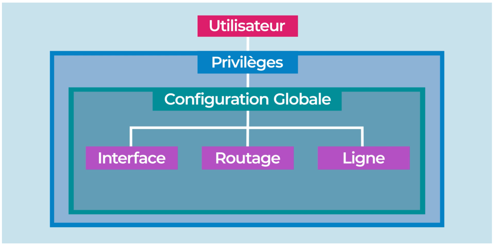

# BGP - eVPN

Dans cette partie, on doit réaliser une topologie réseau composée de routeurs / hosts.
> La topologie est définit dans le fichier `P3.gns3project`.

Dans ce document on accède directement aux shells depuis _GNS3_ en faisant un clic-droit sur l'equipement concerné, et en ouvrant la console auxilliaire.

## Nommage des interfaces réseau

Pour commencer, on devra renommer l'interface `eth0` de l'host `host_fherbine-1` en `eth1` ainsi que l'interface `eth1` du routeur `_aabeque-4` en `eth2`.

### host (`host_fherbine-1`)

```sh
$ ip link set eth0 down
$ ip link set eth0 name eth1
$ ip link set eth1 up
```

### routeur (`_aabelque-4`)

```sh
$ ip link set eth1 down
$ ip link set eth1 name eth2
$ ip link set eth2 up
```

---
## Routeurs & FRRouting

FRRouting offre une _CLI_ semblable à celle de CISCO, avec le système de privilèges suivant:


> Système de privilèges CISCO

La console FRRouting sera accessible grâce à la commande `vtysh` depuis nos routeurs, en effectuant cette commande, nous serons directement en mode _Proivilèges_.

Nous pourrons ainsi configurer nos routeurs en escaladant nos privilèges, d'abord avec `configure terminal`, pour effectuer la configuration globale, et accèder aux autres modes de configurations, `interface` ou `routeur` par exemple.

---

## Configuration des VTEP

Dans notre sujet les _VTEP_ (Virtual Terminaison End-Point), sont au nombres de trois, nos "**Leafs**" sur la topologie, on les configurera en premier.

On ne configurera volontairement pas un des bridges, pour mettre en exergue l'utilité de ces derniers dans notre eVPN.

### router 2

```sh
$ brctl addbr br0 # creation d'un bridge
$ ip link set up dev br0 # activation du bridge
$ ip link add vxlan10 type vxlan id 10 dstport 4789 # creation d'une interface vxlan
$ ip link set up dev vxlan10 # activation de l'interface vxlan
$ brctl addif br0 vxlan10 # ajout interface vxlan10 au bridge
$ brctl addif br0 eth1 # ajout interface eth1 au bridge

$ vtysh # ouvrir le shell frrouting

$ config t # se mettre en mode configuration

$ hostname <nom du vtep> # ici routeur_aabelque-2
$ no ipv6 forwarding # pas de transfert sur l'ipv6

## Setup interface eth0
$ interface eth0
$ ip address 10.1.1.2/30
$ ip ospf area 0

## Setup interface lo
$ interface lo
$ ip address 1.1.1.2/32
$ ip ospf area 0

## Setup bgp
$ router bgp 1
$ neighbor 1.1.1.1 remote-as 1
$ neighbor 1.1.1.1 update-source lo

## Setup evpn
$ address-family l2vpn evpn
$ neighbor 1.1.1.1 activate
$ advertise-all-vni
$ exit-address-family

$ router ospf

```

### router 3

```sh

$ vtysh
$ config t # se mettre en mode configuration

$ hostname <nom du reflecteur> # ici routeur_aabelque-3
$ no ipv6 forwarding # pas de transfert sur l'ipv6

## Setup interface eth1
$ interface eth1
$ ip address 10.1.1.6/30
$ ip ospf area 0

## Setup interface lo
$ interface lo
$ ip address 1.1.1.3/32
$ ip ospf area 0

## Setup bgp
$ router bgp 1
$ neighbor 1.1.1.1 remote-as 1
$ neighbor 1.1.1.1 update-source lo

## Setup evpn
$ address-family l2vpn evpn
$ neighbor 1.1.1.1 activate
$ exit-address-family

$ router ospf

```

### router 4

```sh

$ brctl addbr br0 # creation d un bridge
$ ip link set up dev br0 # activation du bridge
$ ip link add vxlan10 type vxlan id 10 dstport 4789 # creation d une interface vxlan
$ ip link set up dev vxlan10 # activation de l interface vxlan
$ brctl addif br0 vxlan10 # ajout interface vxlan10 au bridge
$ brctl addif br0 eth0 # ajout interface eth0 au bridge

$ vtysh # ouvrir le shell frrouting

$ config t # se mettre en mode configuration

$ hostname <nom du vtep> # ici routeur_aabelque-4
$ no ipv6 forwarding # pas de transfert sur l'ipv6


## Setup interface eth2
$ interface eth2
$ ip address 10.1.1.10/30
$ ip ospf area 0

## Setup interface lo
$ interface lo
$ ip address 1.1.1.4/32
$ ip ospf area 0

## Setup bgp
$ router bgp 1
$ neighbor 1.1.1.1 remote-as 1
$ neighbor 1.1.1.1 update-source lo

## Setup evpn
$ address-family l2vpn evpn
$ neighbor 1.1.1.1 activate
$ advertise-all-vni
$ exit-address-family

$ router ospf

```


---

## Configuration des hosts

Nous allons ensuite attribuer des adresses IPs à nos hôtes:
### host 1

```sh
$ ip addr add 20.1.1.1/24 dev eth1
```
### host 2

```sh
$ ip addr add 20.1.1.2/24 dev eth0
```
### host 3

```sh
$ ip addr add 20.1.1.3/24 dev eth0
```

---

## Configuration du RR (`_aabelque-1`)

Finalement nous pouvons configurer notre Reflecteur (RR):

```sh
$ vtysh # ouvrir le shell frrouting

$ config t # se mettre en mode configuration

$ hostname <nom du reflecteur> # ici routeur_aabelque-1
$ no ipv6 forwarding # pas de transfert sur l'ipv6

## Setup interface eth0
$ interface eth0
$ ip address 10.1.1.1/30

## Setup interface eth1
$ interface eth1
$ ip address 10.1.1.5/30

## Setup interface eth2
$ interface eth2
$ ip address 10.1.1.9/30

## Setup interface lo
$ interface lo
$ ip address 1.1.1.1/32

## Setup bgp
$ router bgp 1
$ neighbor ibgp peer-group
$ neighbor ibgp remote-as 1
$ neighbor ibgp update-source lo
$ bgp listen range 1.1.1.0/29 peer-group ibgp

## Setup evpn
$ address-family l2vpn evpn
$ neighbor ibgp activate
$ neighbor ibgp route-reflector-client
$ exit-address-family

$ router ospf
$ network 0.0.0.0/0 area 0

$ line vty
```